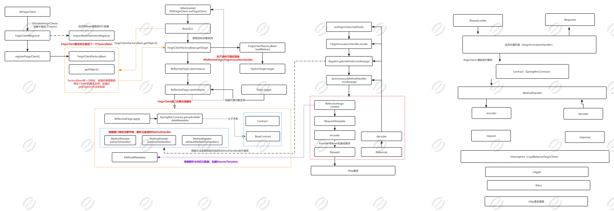

# OpenFeign（声明式的伪RPC）

面向接口进行开发

OKHTTP 优化了很多 HTTP 方法，所以性能要不HTTP要高。

~~~xml
<dependency>
    <groupId>org.springframework.cloud</groupId>
    <artifactId>spring-cloud-starter-openfeign</artifactId>
    <version>2.2.3.RELEASE</version>
</dependency>
~~~

~~~java
@FeignClient("spring-cloud-order-service")
public interface OrderServiceFeignClient {
    
    @GetMapping("/orders")
    String getAllOrder();

}
~~~

~~~java
@RestController
public class OpenFeignController {

    @Autowired
    private OrderServiceFeignClient orderServiceFeignClient; //动态代理

    @GetMapping("/test")
    public String test(){
        return orderServiceFeignClient.getAllOrder();
    }

}
~~~

~~~java
@EnableFeignClients(basePackages = "com.wolfman.netflix.clients")
@SpringBootApplication
public class UserServiceProviderApplication {

    public static void main(String[] args) {
        SpringApplication.run(UserServiceProviderApplication.class, args);
    }
}
~~~

## 示例

- competition-management
- customer-management

# 特性

默认底层通信是 httpclient 的api

使用okhttp：

~~~xml
<dependency>
    <groupId>io.github.openfeign</groupId>
    <artifactId>feign-okhttp</artifactId>
</dependency>
~~~

~~~properties
feign.okhttp.enabled=true
feign.httpclient.enabled=false

# 提供压缩的方式对请求数据进行压缩
feign.compression.response.enabled=true
#请求最小数据的大小
feign.compression.request.min-request-size=2180
#针对哪些请求类型进行压缩
feign.compression.request.mime-types=

# 还有一些http的链接池相关配置
feign.httpclient.max-connections=200
feign.httpclient.connection-timeout=5000
~~~

# 思考 feign 要做的事情

- 参数的解析和装载
- 针对指定的 feignClient，生成动态代理
- 针对 feignClient 中的方法描述进行解析
- 组装出一个Request对象，发起请求

----

# Bean 的动态装载

> 如何动态装载 Bean 对象到 SpringIoC 容器中

- ImportSelector
- ImportBeanDefinitionRegistrar

## ImportBeanDefinitionRegistrar 怎么工作的

- 定义一个需要被装载到 IOC 容器中的类 HelloWorld

~~~java
public class HelloWorld {}
~~~

- 定义一个 Registrar 的实现，定义一个 bean，装载到 IoC 容器

~~~java
public class ExtendImportBeanDefinitionRegistrar implements ImportBeanDefinitionRegistrar {

    @Override
    public void registerBeanDefinitions(AnnotationMetadata importingClassMetadata, BeanDefinitionRegistry registry) {
        BeanDefinition beanDefinition = new GenericBeanDefinition();
        beanDefinition.setBeanClassName(HelloWorld.class.getName());
        registry.registerBeanDefinition("hello", beanDefinition);
    }

}
~~~

- 定义一个注解类

~~~java
@Retention(RetentionPolicy.RUNTIME)
@Target(ElementType.TYPE)
@Documented
@Import(ExtendImportBeanDefinitionRegistrar.class)
public @interface EnableHelloWorldRegistrar {
}
~~~

- 写一个测试类

~~~java

@EnableHelloWorldRegistrar
@EnableFeignClients(basePackages = {"com.wolfman.marathon"})
@SpringBootApplication
public class CompetitionManagementApplication {

	public static void main(String[] args) {
		ConfigurableApplicationContext configurableApplicationContext = SpringApplication.run(CompetitionManagementApplication.class, args);
		System.out.println(configurableApplicationContext.getBean("hello"));
    //com.wolfman.marathon.knowledgeExtend.HelloWorld@6b063470
	}

}
~~~

通过结果演示可以发现，HelloWorld 这个 bean 已经装载到了 IoC 容器。

这就是动态装载的功能实现，它相比于 @Configuration 配置注入，会多了很多的灵活性。

# OpenFeign 源码分析

# 服务启动

## EnableFeignClients

**@EnableFeignClients(basePackages = {"com.wolfman.marathon"})**

这个注解开启了 `@FeignClient` 注解的解析过程。

~~~java
@Retention(RetentionPolicy.RUNTIME)
@Target({ElementType.TYPE})
@Documented
@Import({FeignClientsRegistrar.class})	// 通过 @Import 注解，导入 FeignClientsRegistrar 配置信息
public @interface EnableFeignClients {
    String[] value() default {};

    String[] basePackages() default {};

    Class<?>[] basePackageClasses() default {};

    Class<?>[] defaultConfiguration() default {};

    Class<?>[] clients() default {};
}
~~~

## FeignClientsRegistrar

FeignClientsRegistrar 实现了 ImportBeanDefinitionRegistrar，它是一个动态注入bean的接口， Spring Boot启动的时候，会去调用这个类中的 `registerBeanDefinitions(AnnotationMetadata metadata, BeanDefinitionRegistry registry)` 来实现动态 Bean 的装载。 它的作用类似于ImportSelector。

~~~java
class FeignClientsRegistrar implements ImportBeanDefinitionRegistrar, ResourceLoaderAware, EnvironmentAware {

 	
  @Override
  public void registerBeanDefinitions(AnnotationMetadata metadata, BeanDefinitionRegistry registry) {
    //注册 @EnableFeignClients 中定义 defaultConfiguration 属性下的类，包装成 FeignClientSpecification，注册到Spring容器。
		//在 @FeignClient 中有一个属性 :configuration，这个属性是表示各个FeignClient自定义的配置类，后面也会通过调用registerClientConfiguration 方法来注册成 FeignClientSpecification 到容器。 
    //所以，这里可以完全理解在 @EnableFeignClients 中配置的是做为兜底的配置，在各自 @FeignClient 配置的就是自定义的情况。
    
    //注册默认配置
		registerDefaultConfiguration(metadata, registry);
    //注册feignClient
		registerFeignClients(metadata, registry);
	}
}
~~~

- `registerDefaultConfiguration(metadata, registry);` 方法内部从 SpringBoot 启动类上检查是否有 @EnableFeignClients, 有该注解的话， 则完成 Feign 框架相关的一些配置内容注册。
- `registerFeignClients(metadata, registry);` 方法内部从 classpath 中， 扫描获得 @FeignClient 修饰的类， 将类的内容解析为 BeanDefinition , 最终通过调用 Spring 框架中的 BeanDefinitionReaderUtils.resgisterBeanDefinition 将解析处理过的 FeignClient BeanDeifinition 添加到 spring 容器中。

### FeignClientsRegistrar.registerFeignClients

这个方法主要是扫描类路径下所有的 `@FeignClient` 注解，然后进行动态 Bean 的注入。它最终会调用 registerFeignClient 方法。

~~~java
	public void registerFeignClients(AnnotationMetadata metadata, BeanDefinitionRegistry registry) {
		LinkedHashSet<BeanDefinition> candidateComponents = new LinkedHashSet<>();
		Map<String, Object> attrs = metadata.getAnnotationAttributes(EnableFeignClients.class.getName());
		final Class<?>[] clients = attrs == null ? null : (Class<?>[]) attrs.get("clients");
		if (clients == null || clients.length == 0) {
			ClassPathScanningCandidateComponentProvider scanner = getScanner();
			scanner.setResourceLoader(this.resourceLoader);
			scanner.addIncludeFilter(new AnnotationTypeFilter(FeignClient.class));
			Set<String> basePackages = getBasePackages(metadata);
			for (String basePackage : basePackages) {
				candidateComponents.addAll(scanner.findCandidateComponents(basePackage));
			}
		}
		else {
			for (Class<?> clazz : clients) {
				candidateComponents.add(new AnnotatedGenericBeanDefinition(clazz));
			}
		}
	
    // 循环注入带有 @FeignClient 的接口，并进行动态代理注入到 IoC 容器中。
		for (BeanDefinition candidateComponent : candidateComponents) {
			if (candidateComponent instanceof AnnotatedBeanDefinition beanDefinition) {
				// verify annotated class is an interface
				AnnotationMetadata annotationMetadata = beanDefinition.getMetadata();
				Assert.isTrue(annotationMetadata.isInterface(), "@FeignClient can only be specified on an interface");

				Map<String, Object> attributes = annotationMetadata
						.getAnnotationAttributes(FeignClient.class.getCanonicalName());

				String name = getClientName(attributes);
				String className = annotationMetadata.getClassName();
        // 注册 @FeignClient 注解的配置信息
				registerClientConfiguration(registry, name, className, attributes.get("configuration"));
				// 注册 FeignClient 类
				registerFeignClient(registry, annotationMetadata, attributes);
			}
		}
	}
~~~

### FeignClientsRegistrar.registerFeignClient

> spring.cloud.openfeign.lazy-attributes-resolution 属性，openFeignClient 是否需要进行懒加载

~~~java
private void registerFeignClient(BeanDefinitionRegistry registry, 
                                 AnnotationMetadata annotationMetadata,
                                 Map<String, Object> attributes) {
	// className = com.wolfman.marathon.feign.CustomerManagementClient
  String className = annotationMetadata.getClassName();
	if (String.valueOf(false).equals(
			environment.getProperty("spring.cloud.openfeign.lazy-attributes-resolution", 
                              String.valueOf(false)))) {
		eagerlyRegisterFeignClientBeanDefinition(className, attributes, registry);
	}
	else {
		lazilyRegisterFeignClientBeanDefinition(className, attributes, registry);
	}
}
~~~

### FeignClientsRegistrar.eagerlyRegisterFeignClientBeanDefinition

~~~java
private void eagerlyRegisterFeignClientBeanDefinition(String className, 
                                                      Map<String, Object> attributes,
                                                      BeanDefinitionRegistry registry) {
		validate(attributes);
  	// 注入一个工厂bean
    // → FeignClientFactoryBean
		BeanDefinitionBuilder definition = BeanDefinitionBuilder.genericBeanDefinition(FeignClientFactoryBean.class);
		definition.addPropertyValue("url", getUrl(null, attributes));
		definition.addPropertyValue("path", getPath(null, attributes));
		String name = getName(attributes);
		definition.addPropertyValue("name", name);
		String contextId = getContextId(null, attributes);
		definition.addPropertyValue("contextId", contextId);
		definition.addPropertyValue("type", className);
		definition.addPropertyValue("dismiss404", Boolean.parseBoolean(String.valueOf(attributes.get("dismiss404"))));
		Object fallback = attributes.get("fallback");
		if (fallback != null) {
			definition.addPropertyValue("fallback",
					(fallback instanceof Class ? fallback : ClassUtils.resolveClassName(fallback.toString(), null)));
		}
		Object fallbackFactory = attributes.get("fallbackFactory");
		if (fallbackFactory != null) {
			definition.addPropertyValue("fallbackFactory", fallbackFactory instanceof Class ? fallbackFactory
					: ClassUtils.resolveClassName(fallbackFactory.toString(), null));
		}
		definition.addPropertyValue("fallbackFactory", attributes.get("fallbackFactory"));
		definition.setAutowireMode(AbstractBeanDefinition.AUTOWIRE_BY_TYPE);
		definition.addPropertyValue("refreshableClient", isClientRefreshEnabled());
		String[] qualifiers = getQualifiers(attributes);
		if (ObjectUtils.isEmpty(qualifiers)) {
			qualifiers = new String[] { contextId + "FeignClient" };
		}
		// This is done so that there's a way to retrieve qualifiers while generating AOT
		// code
		definition.addPropertyValue("qualifiers", qualifiers);
		AbstractBeanDefinition beanDefinition = definition.getBeanDefinition();
		Class<?> type = ClassUtils.resolveClassName(className, null);
		beanDefinition.setAttribute(FactoryBean.OBJECT_TYPE_ATTRIBUTE, type);
		// has a default, won't be null
		boolean primary = (Boolean) attributes.get("primary");
		beanDefinition.setPrimary(primary);
		BeanDefinitionHolder holder = new BeanDefinitionHolder(beanDefinition, className, qualifiers);
  	BeanDefinitionReaderUtils.registerBeanDefinition(holder, registry);
		registerRefreshableBeanDefinition(registry, contextId, Request.Options.class, OptionsFactoryBean.class);
		registerRefreshableBeanDefinition(registry, contextId, RefreshableUrl.class, RefreshableUrlFactoryBean.class);
}
~~~

## FeignClientFactoryBean.getObject

getObject 调用的是 getTarget 方法，它从applicationContext取出FeignContext，FeignContext继承了 NamedContextFactory，它是用来来统一维护feign中各个feign客户端相互隔离的上下文。

> FeignContext注册到容器是在FeignAutoConfiguration上完成的

~~~java
@Override
public Object getObject() {
	return getTarget();
}

<T> T getTarget() {
		FeignClientFactory feignClientFactory = beanFactory != null ? beanFactory.getBean(FeignClientFactory.class)
				: applicationContext.getBean(FeignClientFactory.class);
		Feign.Builder builder = feign(feignClientFactory);
		if (!StringUtils.hasText(url) && !isUrlAvailableInConfig(contextId)) {
      // 如果url为空，则走负载均衡，生成有负载均衡功 能的代理类
			if (LOG.isInfoEnabled()) {
				LOG.info("For '" + name + "' URL not provided. Will try picking an instance via load-balancing.");
			}
			if (!name.startsWith("http://") && !name.startsWith("https://")) {
				url = "http://" + name;
			}
			else {
				url = name;
			}
			url += cleanPath();
			return (T) loadBalance(builder, feignClientFactory, new HardCodedTarget<>(type, name, url));
		}
  	// 如果指定了url，则生成默认的代理类
		if (StringUtils.hasText(url) && !url.startsWith("http://") && !url.startsWith("https://")) {
			url = "http://" + url;
		}
		Client client = getOptional(feignClientFactory, Client.class);
		if (client != null) {
			if (client instanceof FeignBlockingLoadBalancerClient) {
				// not load balancing because we have a url,
				// but Spring Cloud LoadBalancer is on the classpath, so unwrap
				client = ((FeignBlockingLoadBalancerClient) client).getDelegate();
			}
			if (client instanceof RetryableFeignBlockingLoadBalancerClient) {
				// not load balancing because we have a url,
				// but Spring Cloud LoadBalancer is on the classpath, so unwrap
				client = ((RetryableFeignBlockingLoadBalancerClient) client).getDelegate();
			}
			builder.client(client);
		}

		applyBuildCustomizers(feignClientFactory, builder);
		//生成默认代理类
		Targeter targeter = get(feignClientFactory, Targeter.class);
		return targeter.target(this, builder, feignClientFactory, resolveTarget(feignClientFactory, contextId, url));
	
 }
~~~

### FeignClientFactoryBean.feign

~~~java
protected Feign.Builder feign(FeignContext context) {
	FeignLoggerFactory loggerFactory = get(context, FeignLoggerFactory.class);
	Logger logger = loggerFactory.create(this.type);

	// @formatter:off
	Feign.Builder builder = get(context, Feign.Builder.class)
			// required values
			.logger(logger)
			.encoder(get(context, Encoder.class))
			.decoder(get(context, Decoder.class))
        	//用来解析模板的
			.contract(get(context, Contract.class));
	// @formatter:on

	configureFeign(context, builder);

	return builder;
}
~~~

## ReflectiveFeign.newInstance

这个方法是用来创建一个动态代理的方法，在生成动态代理之前，会根据 Contract 协议(协议解析规 则，解析接口类的注解信息，解析成内部的 MethodHandler 的处理方式。

从实现的代码中可以看到熟悉的Proxy.newProxyInstance方法产生代理类。而这里需要对每个定义的接口方法进行特定的处理实现，所以这里会出现一个 MethodHandler 的概念，就是对应方法级别的 InvocationHandler。

~~~java
public <T> T newInstance(Target<T> target, C requestContext) {
  TargetSpecificationVerifier.verify(target);
	// 解析 client 请求参数
  Map<Method, MethodHandler> methodToHandler =
      targetToHandlersByName.apply(target, requestContext);
  InvocationHandler handler = factory.create(target, methodToHandler);
  // 基于 Proxy.newProxyInstance 为接口类创建动态实现，将所有的请求转换给 InvocationHandler 处理。
  T proxy = (T) Proxy.newProxyInstance(target.type().getClassLoader(),
      new Class<?>[] {target.type()}, handler);

  for (MethodHandler methodHandler : methodToHandler.values()) {
    if (methodHandler instanceof DefaultMethodHandler) {
      ((DefaultMethodHandler) methodHandler).bindTo(proxy);
    }
  }

  return proxy;
}
~~~

### targetToHandlersByName.apply(target)

根据 Contract 协议规则，解析接口类的注解信息，解析成内部表现：

`ReflectiveFeign.ParseHandlersByName.apply(Target target, C requestContext)` 会解析接口方法上的注解，从而解析出方法粒度的特定的配置信息，然后生产一个 AsynchronousMethodHandler 类，需要维护一个 <method，MethodHandler> 的map，放入InvocationHandler 的实现 FeignInvocationHandler 中。

~~~java
public Map<Method, MethodHandler> apply(Target target, C requestContext) {
  final Map<Method, MethodHandler> result = new LinkedHashMap<>();

  final List<MethodMetadata> metadataList = contract.parseAndValidateMetadata(target.type());
  for (MethodMetadata md : metadataList) {
    final Method method = md.method();
    if (method.getDeclaringClass() == Object.class) {
      continue;
    }

    final MethodHandler handler = createMethodHandler(target, md, requestContext);
    result.put(method, handler);
  }

  for (Method method : target.type().getMethods()) {
    if (Util.isDefault(method)) {
      final MethodHandler handler = new DefaultMethodHandler(method);
      result.put(method, handler);
    }
  }

  return result;
}
~~~

## FeignAutoConfiguration

~~~java
@Configuration(proxyBeanMethods = false)
@ConditionalOnClass(Feign.class)
@EnableConfigurationProperties({ FeignClientProperties.class,
		FeignHttpClientProperties.class })
@Import(DefaultGzipDecoderConfiguration.class)
public class FeignAutoConfiguration {
  
}
~~~

# 服务运行时

在服务启动分析中，我们知道 OpenFeign 最终返回的是一个#ReflectiveFeign.FeignInvocationHandler的

那么当客户端发起请求时，会进入到 FeignInvocationHandler.invoke 方法中，它是一个动态代理的实现。

~~~java
@Override
public Object invoke(Object proxy, Method method, Object[] args) throws Throwable {
  if ("equals".equals(method.getName())) {
    try {
      Object otherHandler =
          args.length > 0 && args[0] != null ? Proxy.getInvocationHandler(args[0]) : null;
      return equals(otherHandler);
    } catch (IllegalArgumentException e) {
      return false;
    }
  } else if ("hashCode".equals(method.getName())) {
    return hashCode();
  } else if ("toString".equals(method.getName())) {
    return toString();
  } else if (!dispatch.containsKey(method)) {
    throw new UnsupportedOperationException(
        String.format("Method \"%s\" should not be called", method.getName()));
  }
	// 前边是一些校验
  return dispatch.get(method).invoke(args);
}
~~~

而接着，在 invoke 方法中，会调用 this.dispatch.get(method) 会返回一个 SynchronousMethodHandler，进行拦截处理。

这个方法会根据参数生成完成的 RequestTemplate 对象，这个对象是 Http 请求的模版，代码如下：

## **SynchronousMethodHandler.invoke**

~~~java
@Override
public Object invoke(Object[] argv) throws Throwable {
  RequestTemplate template = buildTemplateFromArgs.create(argv);
  Options options = findOptions(argv);
  Retryer retryer = this.retryer.clone();
  while (true) {
    try {
      return executeAndDecode(template, options);
    } catch (RetryableException e) {
      try {
        retryer.continueOrPropagate(e);
      } catch (RetryableException th) {
        Throwable cause = th.getCause();
        if (propagationPolicy == UNWRAP && cause != null) {
          throw cause;
        } else {
          throw th;
        }
      }
      if (logLevel != Logger.Level.NONE) {
        logger.logRetry(metadata.configKey(), logLevel);
      }
      continue;
    }
  }
}
~~~

## **SynchronousMethodHandler.executeAndDecode**

经过上述的代码，我们已经将restTemplate拼装完成，上面的代码中有一个 executeAndDecode() 方 法，该方法通过RequestTemplate生成Request请求对象，然后利用 HttpClient 获取 response，来获取响应信息。

~~~java
Object executeAndDecode(RequestTemplate template, Options options) throws Throwable {
  // 转化为 Http 请求报文
  Request request = targetRequest(template);

  if (logLevel != Logger.Level.NONE) {
    logger.logRequest(metadata.configKey(), logLevel, request);
  }

  Response response;
  long start = System.nanoTime();
  try {
    // 发起远程通信
    response = client.execute(request, options);
    // ensure the request is set. TODO: remove in Feign 12
    // 获取返回结果
    response = response.toBuilder()
        .request(request)
        .requestTemplate(template)
        .build();
  } catch (IOException e) {
    if (logLevel != Logger.Level.NONE) {
      logger.logIOException(metadata.configKey(), logLevel, e, elapsedTime(start));
    }
    throw errorExecuting(request, e);
  }

  long elapsedTime = TimeUnit.NANOSECONDS.toMillis(System.nanoTime() - start);
  return responseHandler.handleResponse(
      metadata.configKey(), response, metadata.returnType(), elapsedTime);
}
~~~

## Client.execute

~~~java
@Override
public Response execute(Request request, Options options) throws IOException {
  HttpURLConnection connection = convertAndSend(request, options);
  return convertResponse(connection, request);
}

Response convertResponse(HttpURLConnection connection, Request request) throws IOException {
  int status = connection.getResponseCode();
  String reason = connection.getResponseMessage();

  if (status < 0) {
    throw new IOException(format("Invalid status(%s) executing %s %s", status,
        connection.getRequestMethod(), connection.getURL()));
  }

  Map<String, Collection<String>> headers = new TreeMap<>(CASE_INSENSITIVE_ORDER);
  for (Map.Entry<String, List<String>> field : connection.getHeaderFields().entrySet()) {
    // response message
    if (field.getKey() != null) {
      headers.put(field.getKey(), field.getValue());
    }
  }

  Integer length = connection.getContentLength();
  if (length == -1) {
    length = null;
  }
  InputStream stream;
  if (status >= 400) {
    stream = connection.getErrorStream();
  } else {
    stream = connection.getInputStream();
  }
  if (this.isGzip(headers.get(CONTENT_ENCODING))) {
    stream = new GZIPInputStream(stream);
  } else if (this.isDeflate(headers.get(CONTENT_ENCODING))) {
    stream = new InflaterInputStream(stream);
  }
  return Response.builder()
      .status(status)
      .reason(reason)
      .headers(headers)
      .request(request)
      .body(stream, length)
      .build();
}
~~~

# openFeign 开启日志级别

~~~java
@Configuration
public class FeignLogConfig {

    @Bean
    Logger.Level feignLogger(){
        return Logger.Level.FULL;// 记录所有日志
    }
}
~~~

~~~properties
logging.level.com.wolfman.openfeign.clients.OrderServiceFeignClient=DEBUG
~~~

# LoadBalancerAutoConfiguration

~~~java
@AutoConfiguration
@Conditional(BlockingRestClassesPresentCondition.class)
@ConditionalOnBean(LoadBalancerClient.class)
@EnableConfigurationProperties(LoadBalancerClientsProperties.class)
public class LoadBalancerAutoConfiguration {
  
}
~~~

## LoadBalancerClientsProperties
