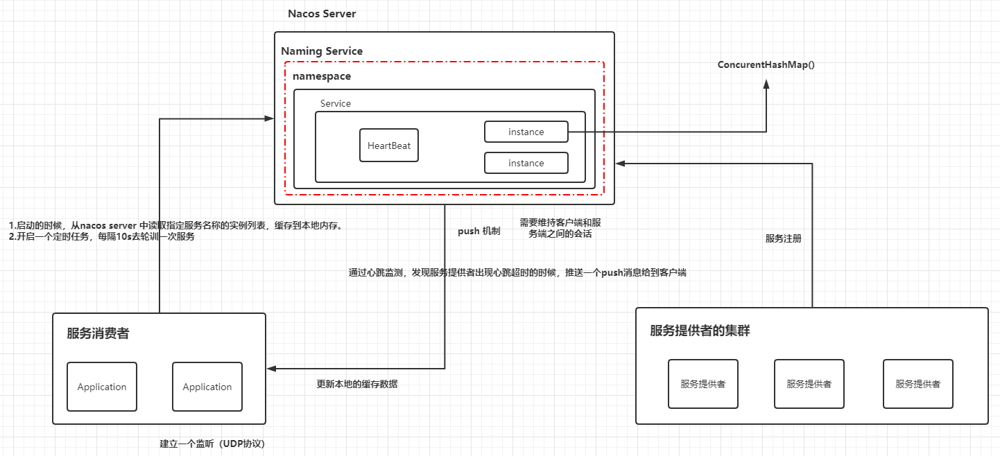

# Nacos 服务注册的原理

## Nacos 服务注册需要具备的能力

- 服务提供者把自己的协议地址注册到 Nacos server
- 服务消费者需要从 Nacos Server 上去查询服务提供者的地址（根据服务名称）
- Nacos Server 需要感知服务提供者的上下线的变化
- 服务消费者需要动态感知到 Nacos Server 端服务地址的变化


## Nacos API

SDK / OPEN API（Rest接口）

```java
@RestController
public class RegisterTestController {

    @NacosInjected
    private NamingService namingService;    // 服务注册功能的Service

    @GetMapping("/get")
    public String get() throws NacosException {
        return namingService.getAllInstances("spring-boot-nacos-demo").toString();
    }

    @PostMapping("/registry")
    public String registry() throws NacosException {
        Instance instance = new Instance();
        instance.setClusterName("TestCluster");
        instance.setEnabled(true);
        instance.setEphemeral(true); // 临时节点（CP模式-Raft算法） / 持久化节点（AP模式-Distro）
        instance.setIp("192.168.1.134");
        instance.setPort(8888);
        instance.setWeight(10); // 1~100
        namingService.registerInstance("spring-boot-nacos-demo",instance);
        return "SUCCESS";
    }
}
```

### 服务注册

~~~java
registerInstance(String serviceName, String ip, int port);
registerInstance(..., String clusterName);
registerInstance(String serviceName, Instance instance);
~~~

> 临时节点（CP模式-Raft算法） / 持久化节点（AP模式-Distro算法）

### 服务查询

~~~java
List<Instance> getAllInstances(String serviceName) throws NacosException;
List<Instance> getAllInstances(String serviceName, String groupName) throws NacosException;
List<Instance> getAllInstances(String serviceName, boolean subscribe) throws NacosException;
List<Instance> getAllInstances(String serviceName, List<String> clusters) throws NacosException;
~~~

### 心跳机制

- 心跳的发送间隔
- 心跳的超时时间
  - 设置一个心跳超时的阈值
  - 记录针对于某一个服务实例的最后一次更新的时间
  - 当前时间 - 当前实例最后一次更新的时间 > 心跳超时的阈值


# Nacos 的实现原理

**客户端**

启动的时候，会去 nacos server 中读取指定服务名称的实例列表，缓存到本地内存。

开启一个定时任务，每隔10s去轮训一次服务列表。（Eureka中，是每隔30秒去请求一次）




# Nacos 的源码分析

分析是基于 Spring Cloud Alibaba

> set('springCloudAlibabaVersion', "2023.0.1.2")


# 服务提供者 - 服务注册

spring boot 启动完成后会发布 ServletWebServerInitializedEvent 这个事件。

```java
@Override
public void start() {
	this.webServer.start();
	this.running = true;
	this.applicationContext
		.publishEvent(new ServletWebServerInitializedEvent(this.webServer, this.applicationContext));
}
```

```java
public void onApplicationEvent(WebServerInitializedEvent event) {
	ApplicationContext context = event.getApplicationContext();
	if (context instanceof ConfigurableWebServerApplicationContext) {
		if ("management".equals(((ConfigurableWebServerApplicationContext) context).getServerNamespace())) {
			return;
		}
	}
	this.port.compareAndSet(0, event.getWebServer().getPort());
	this.start();
}
```

# NacosServiceRegistry

~~~java
@Override
public void register(Registration registration) {

	if (StringUtils.isEmpty(registration.getServiceId())) {
		log.warn("No service to register for nacos client...");
		return;
	}

	NamingService namingService = namingService();
  // customer-management
	String serviceId = registration.getServiceId();
  // DEFAULT_GROUP
	String group = nacosDiscoveryProperties.getGroup();

  // 构建一个服务实例
	Instance instance = getNacosInstanceFromRegistration(registration);

	try {
    // → 注册
		namingService.registerInstance(serviceId, group, instance);
		log.info("nacos registry, {} {} {}:{} register finished", group, serviceId,
				instance.getIp(), instance.getPort());
	}
	catch (Exception e) {
		if (nacosDiscoveryProperties.isFailFast()) {
			log.error("nacos registry, {} register failed...{},", serviceId,
					registration.toString(), e);
			rethrowRuntimeException(e);
		}
		else {
			log.warn("Failfast is false. {} register failed...{},", serviceId,
					registration.toString(), e);
		}
	}
}
~~~


## NacosServiceRegistry.getNacosInstanceFromRegistration

~~~java
private Instance getNacosInstanceFromRegistration(Registration registration) {
	Instance instance = new Instance();
	instance.setIp(registration.getHost());
	instance.setPort(registration.getPort());
	instance.setWeight(nacosDiscoveryProperties.getWeight());
	instance.setClusterName(nacosDiscoveryProperties.getClusterName());
	instance.setEnabled(nacosDiscoveryProperties.isInstanceEnabled());
	instance.setMetadata(registration.getMetadata());
	instance.setEphemeral(nacosDiscoveryProperties.isEphemeral());
	return instance;
}
~~~


## NacosNamingService.registerInstance

```java
@Override
public void registerInstance(String serviceName, String groupName, Instance instance) throws NacosException {
    NamingUtils.checkInstanceIsLegal(instance);
    checkAndStripGroupNamePrefix(instance, groupName);
    clientProxy.registerService(serviceName, groupName, instance);
}
```


## NamingClientProxyDelegate.registerService

```java
@Override
public void registerService(String serviceName, String groupName, Instance instance) throws NacosException { 
  getExecuteClientProxy(instance).registerService(serviceName, groupName, instance);
}

    
private NamingClientProxy getExecuteClientProxy(Instance instance) {
  if (instance.isEphemeral() || grpcClientProxy.isAbilitySupportedByServer(AbilityKey.SERVER_SUPPORT_PERSISTENT_INSTANCE_BY_GRPC)) {
    // -> 
    return grpcClientProxy;
  }
  return httpClientProxy;
}
```


## NamingGrpcClientProxy.registerService

```java
@Override
public void registerService(String serviceName, String groupName, Instance instance) throws NacosException {  
  NAMING_LOGGER.info("[REGISTER-SERVICE] {} registering service {} with instance {}", namespaceId, serviceName,instance);
  if (instance.isEphemeral()) {
    registerServiceForEphemeral(serviceName, groupName, instance);
  } else {
    doRegisterServiceForPersistent(serviceName, groupName, instance);
  }
}

private void registerServiceForEphemeral(String serviceName, String groupName, Instance instance) throws NacosException {
  // 
  redoService.cacheInstanceForRedo(serviceName, groupName, instance);
  // →
  doRegisterService(serviceName, groupName, instance);
}

public void doRegisterService(String serviceName, String groupName, Instance instance) throws NacosException {
  InstanceRequest request = new InstanceRequest(namespaceId, serviceName, groupName,
          NamingRemoteConstants.REGISTER_INSTANCE, instance);
  requestToServer(request, Response.class);
  redoService.instanceRegistered(serviceName, groupName);
}

    private <T extends Response> T requestToServer(AbstractNamingRequest request, Class<T> responseClass)
            throws NacosException {
        Response response = null;
        try {
            request.putAllHeader(
                    getSecurityHeaders(request.getNamespace(), request.getGroupName(), request.getServiceName()));
            response = requestTimeout < 0 ? rpcClient.request(request) : rpcClient.request(request, requestTimeout);
            if (ResponseCode.SUCCESS.getCode() != response.getResultCode()) {
                throw new NacosException(response.getErrorCode(), response.getMessage());
            }
            if (responseClass.isAssignableFrom(response.getClass())) {
                return (T) response;
            }
            NAMING_LOGGER.error("Server return unexpected response '{}', expected response should be '{}'",
                    response.getClass().getName(), responseClass.getName());
            throw new NacosException(NacosException.SERVER_ERROR, "Server return invalid response");
        } catch (NacosException e) {
            recordRequestFailedMetrics(request, e, response);
            throw e;
        } catch (Exception e) {
            recordRequestFailedMetrics(request, e, response);
            throw new NacosException(NacosException.SERVER_ERROR, "Request nacos server failed: ", e);
        }
    }
```


### NamingProxy.registerService

```java
/**
 * 代码逻辑很简单，构建请求参数
 * 发起请求
 */
public void registerService(String serviceName, String groupName, Instance instance) throws NacosException {
    NAMING_LOGGER.info("[REGISTER-SERVICE] {} registering service {} with instance: {}", namespaceId, serviceName,
            instance);
    final Map<String, String> params = new HashMap<String, String>(16);
    params.put(CommonParams.NAMESPACE_ID, namespaceId);
    params.put(CommonParams.SERVICE_NAME, serviceName);
    params.put(CommonParams.GROUP_NAME, groupName);
    params.put(CommonParams.CLUSTER_NAME, instance.getClusterName());
    params.put("ip", instance.getIp());
    params.put("port", String.valueOf(instance.getPort()));
    params.put("weight", String.valueOf(instance.getWeight()));
    params.put("enable", String.valueOf(instance.isEnabled()));
    params.put("healthy", String.valueOf(instance.isHealthy()));
    params.put("ephemeral", String.valueOf(instance.isEphemeral()));
    params.put("metadata", JacksonUtils.toJson(instance.getMetadata()));
    // →
    reqApi(UtilAndComs.nacosUrlInstance, params, HttpMethod.POST);
}
```

### NamingProxy.reqApi

```java
/**
 * Request api.
 * 发起服务注册请求。
 * 随机算法获取一个服务地址，进行调用，失败时，采用轮询的方式继续进行请求
 */
public String reqApi(String api, Map<String, String> params, Map<String, String> body, List<String> servers,
        String method) throws NacosException {
    params.put(CommonParams.NAMESPACE_ID, getNamespaceId());
    if (CollectionUtils.isEmpty(servers) && StringUtils.isEmpty(nacosDomain)) {
        throw new NacosException(NacosException.INVALID_PARAM, "no server available");
    }
    NacosException exception = new NacosException();
    //如果服务地址不为空
    if (servers != null && !servers.isEmpty()) {
        // 随机获取一台服务器节点
        Random random = new Random(System.currentTimeMillis());
        int index = random.nextInt(servers.size());
        // 遍历服务列表
        for (int i = 0; i < servers.size(); i++) {
            // 获得索引位置的服务节点
            String server = servers.get(index);
            try {
                // → 调用指定服务
                return callServer(api, params, body, server, method);
            } catch (NacosException e) {
                exception = e;
                if (NAMING_LOGGER.isDebugEnabled()) {
                    NAMING_LOGGER.debug("request {} failed.", server, e);
                }
            }
            //轮询
            index = (index + 1) % servers.size();
        }
    }
    if (StringUtils.isNotBlank(nacosDomain)) {
        for (int i = 0; i < UtilAndComs.REQUEST_DOMAIN_RETRY_COUNT; i++) {
            try {
                return callServer(api, params, body, nacosDomain, method);
            } catch (NacosException e) {
                exception = e;
                if (NAMING_LOGGER.isDebugEnabled()) {
                    NAMING_LOGGER.debug("request {} failed.", nacosDomain, e);
                }
            }
        }
    }
    NAMING_LOGGER.error("request: {} failed, servers: {}, code: {}, msg: {}", api, servers, exception.getErrCode(),
            exception.getErrMsg());
    throw new NacosException(exception.getErrCode(),
            "failed to req API:" + api + " after all servers(" + servers + ") tried: " + exception.getMessage());
}
```

### NamingProxy.callServer

```java
/**
 * 发起服务调用
 */
public String callServer(String api, Map<String, String> params, Map<String, String> body, String curServer,
        String method) throws NacosException {
    long start = System.currentTimeMillis();
    long end = 0;
    //添加签名信息
    injectSecurityInfo(params);
    //添加头信息
    Header header = builderHeader();
    //拼接url地址
    String url;
    if (curServer.startsWith(UtilAndComs.HTTPS) || curServer.startsWith(UtilAndComs.HTTP)) {
        url = curServer + api;
    } else {
        if (!curServer.contains(UtilAndComs.SERVER_ADDR_IP_SPLITER)) {
            curServer = curServer + UtilAndComs.SERVER_ADDR_IP_SPLITER + serverPort;
        }
        url = NamingHttpClientManager.getInstance().getPrefix() + curServer + api;
    }
    
    try {
        //通过httpclient发起请求
        HttpRestResult<String> restResult = nacosRestTemplate
                .exchangeForm(url, header, params, body, method, String.class);
        end = System.currentTimeMillis();
        
        MetricsMonitor.getNamingRequestMonitor(method, url, String.valueOf(restResult.getCode()))
                .observe(end - start);
        
        if (restResult.ok()) {
            return restResult.getData();
        }
        if (HttpStatus.SC_NOT_MODIFIED == restResult.getCode()) {
            return StringUtils.EMPTY;
        }
        throw new NacosException(restResult.getCode(), restResult.getMessage());
    } catch (Exception e) {
        NAMING_LOGGER.error("[NA] failed to request", e);
        throw new NacosException(NacosException.SERVER_ERROR, e);
    }
}
```


## Nacos 服务端接收提供者请求

com.alibaba.nacos.naming.controllers

### InstanceController

> 把客户端传递过来的服务实例保存

```java
@CanDistro
@PostMapping
@Secured(parser = NamingResourceParser.class, action = ActionTypes.WRITE)
public String register(HttpServletRequest request) throws Exception {
    // 代表客户端的项目名称
    final String serviceName = WebUtils.required(request, CommonParams.SERVICE_NAME);
    //  nacos 的namespace
    final String namespaceId = WebUtils
            .optional(request, CommonParams.NAMESPACE_ID, Constants.DEFAULT_NAMESPACE_ID);
    //从请求中解析出 instance 实例
    final Instance instance = parseInstance(request);
    // →
    serviceManager.registerInstance(namespaceId, serviceName, instance);
    return "ok";
}
```

### ServiceManager.registerInstance

```java
public void registerInstance(String namespaceId, String serviceName, Instance instance) throws NacosException {
    // 创建一个空服务，在Nacos控制台服务列表展示的服务信息，实际上是初始化一个serviceMap，它是一个ConcurrentHashMap集合
    // 	初始化一个serviceMap
    // 	初始化当前服务提供者的服务信息 
    // →
    createEmptyService(namespaceId, serviceName, instance.isEphemeral());
    // 从serviceMap中，根据namespaceId和serviceName得到一个服务对象
    // namespaceId / serviceName / groupName
    Service service = getService(namespaceId, serviceName);
    
    if (service == null) {
        throw new NacosException(NacosException.INVALID_PARAM,
                "service not found, namespace: " + namespaceId + ", service: " + serviceName);
    }
    // 把客户端传递过来的实例信息保存到 service 中
    addInstance(namespaceId, serviceName, instance.isEphemeral(), instance);
}
```


> Nacos Server 端，会通过如下的结构去存储服务提供者的地址信息

```java
/**
 * Map(namespace, Map(group::serviceName, Service)).
 */
private final Map<String, Map<String, Service>> serviceMap = new ConcurrentHashMap<>();
```

~~~hava
key	namespace
	Map<String, Service>
		serviceName(group:serviceName), Service
						Cluster
							List<Instance>
~~~

### ServiceManager.createServiceIfAbsent

```java
/**
 * Create service if not exist.
 */
public void createServiceIfAbsent(String namespaceId, String serviceName, boolean local, Cluster cluster)
        throws NacosException {
    //从serviceMap中获取服务对象
    Service service = getService(namespaceId, serviceName);
    if (service == null) {//如果为空。则初始化
        Loggers.SRV_LOG.info("creating empty service {}:{}", namespaceId, serviceName);
        service = new Service();
        service.setName(serviceName);
        service.setNamespaceId(namespaceId);
        service.setGroupName(NamingUtils.getGroupName(serviceName));
        // now validate the service. if failed, exception will be thrown
        service.setLastModifiedMillis(System.currentTimeMillis());
        service.recalculateChecksum();
        if (cluster != null) {
            cluster.setService(service);
            service.getClusterMap().put(cluster.getName(), cluster);
        }
        service.validate();
        // →
        putServiceAndInit(service);
        if (!local) {
            addOrReplaceService(service);
        }
    }
}
```

### ServiceManager.createServiceIfAbsent

```java
private void putServiceAndInit(Service service) throws NacosException {
    //把服务信息保存到serviceMap集合
    putService(service);
    //建立心跳检测机制
    service.init();
    //实现数据一致性监听，ephemeral=true表示采用raft协议，false表示采用Distro
    consistencyService
            .listen(KeyBuilder.buildInstanceListKey(service.getNamespaceId(), service.getName(), true), service);
    consistencyService
            .listen(KeyBuilder.buildInstanceListKey(service.getNamespaceId(), service.getName(), false), service);
    Loggers.SRV_LOG.info("[NEW-SERVICE] {}", service.toJson());
}
```

### ServiceManager.addInstance

```java
/**
 * Add instance to service.
 * 把服务实例添加到集合中，然后基于一致性协议进行数据的同步。
 */
public void addInstance(String namespaceId, String serviceName, boolean ephemeral, Instance... ips)
        throws NacosException {
    
    String key = KeyBuilder.buildInstanceListKey(namespaceId, serviceName, ephemeral);
    
    Service service = getService(namespaceId, serviceName);
    
    synchronized (service) {
        List<Instance> instanceList = addIpAddresses(service, ephemeral, ips);
        
        Instances instances = new Instances();
        instances.setInstanceList(instanceList);
        
        consistencyService.put(key, instances);
    }
}
```


#### 推送异常的服务提供者信息

#### Service.init()

```java
/**
 * Init service.
 * 这个init方法，会和当前服务提供者建立一个心跳检测机制，这个心跳检测会每5s执行一次。
 */
public void init() {
    //健康检测，每隔5s
    HealthCheckReactor.scheduleCheck(clientBeatCheckTask);
    for (Map.Entry<String, Cluster> entry : clusterMap.entrySet()) {
        entry.getValue().setService(this);
        entry.getValue().init();
    }
}
```

```java
@JsonIgnore
private ClientBeatCheckTask clientBeatCheckTask = new ClientBeatCheckTask(this);
```

#### ClientBeatCheckTask

```java
@Override
public void run() {
    try {
        if (!getDistroMapper().responsible(service.getName())) {
            return;
        }
        
        if (!getSwitchDomain().isHealthCheckEnabled()) {
            return;
        }
        
        List<Instance> instances = service.allIPs(true);
        
        // first set health status of instances:
        for (Instance instance : instances) {//遍历服务节点进行心跳检测
            //如果服务实例的最后一次心跳时间大于设置的超时时间，则认为这个服务已经下线。
            if (System.currentTimeMillis() - instance.getLastBeat() > instance.getInstanceHeartBeatTimeOut()) {
                if (!instance.isMarked()) {
                    if (instance.isHealthy()) {
                        instance.setHealthy(false);
                        Loggers.EVT_LOG
                                .info("{POS} {IP-DISABLED} valid: {}:{}@{}@{}, region: {}, msg: client timeout after {}, last beat: {}",
                                        instance.getIp(), instance.getPort(), instance.getClusterName(),
                                        service.getName(), UtilsAndCommons.LOCALHOST_SITE,
                                        instance.getInstanceHeartBeatTimeOut(), instance.getLastBeat());
                        //推送服务变更事件
                        getPushService().serviceChanged(service);
                        ApplicationUtils.publishEvent(new InstanceHeartbeatTimeoutEvent(this, instance));
                    }
                }
            }
        }
        
        if (!getGlobalConfig().isExpireInstance()) {
            return;
        }
        
        // then remove obsolete instances:
        for (Instance instance : instances) {
            
            if (instance.isMarked()) {
                continue;
            }
            
            if (System.currentTimeMillis() - instance.getLastBeat() > instance.getIpDeleteTimeout()) {
                // delete instance
                Loggers.SRV_LOG.info("[AUTO-DELETE-IP] service: {}, ip: {}", service.getName(),
                        JacksonUtils.toJson(instance));
                deleteIp(instance);//删除过期的服务实例
            }
        }
        
    } catch (Exception e) {
        Loggers.SRV_LOG.warn("Exception while processing client beat time out.", e);
    }
    
}
```

#### PushService.serviceChanged

```java
/**
 * Service changed.
 *
 * @param service service
 */
public void serviceChanged(Service service) {
    // merge some change events to reduce the push frequency:
    if (futureMap
            .containsKey(UtilsAndCommons.assembleFullServiceName(service.getNamespaceId(), service.getName()))) {
        return;
    }
    // →
    this.applicationContext.publishEvent(new ServiceChangeEvent(this, service));
}
```

#### PushService.onApplicationEvent

根据发布的事件，进行监听

```java
/**
 * 监听服务状态变更事件，然后遍历所有的客户端，通过udp协议进行消息的广播通知
 */
@Override
public void onApplicationEvent(ServiceChangeEvent event) {
    Service service = event.getService();
    String serviceName = service.getName();
    String namespaceId = service.getNamespaceId();
    
    Future future = GlobalExecutor.scheduleUdpSender(() -> {
        try {
            Loggers.PUSH.info(serviceName + " is changed, add it to push queue.");
            ConcurrentMap<String, PushClient> clients = clientMap
                    .get(UtilsAndCommons.assembleFullServiceName(namespaceId, serviceName));
            if (MapUtils.isEmpty(clients)) {
                return;
            }
            
            Map<String, Object> cache = new HashMap<>(16);
            long lastRefTime = System.nanoTime();
            for (PushClient client : clients.values()) {
                if (client.zombie()) {
                    Loggers.PUSH.debug("client is zombie: " + client.toString());
                    clients.remove(client.toString());
                    Loggers.PUSH.debug("client is zombie: " + client.toString());
                    continue;
                }
                
                Receiver.AckEntry ackEntry;
                Loggers.PUSH.debug("push serviceName: {} to client: {}", serviceName, client.toString());
                String key = getPushCacheKey(serviceName, client.getIp(), client.getAgent());
                byte[] compressData = null;
                Map<String, Object> data = null;
                if (switchDomain.getDefaultPushCacheMillis() >= 20000 && cache.containsKey(key)) {
                    org.javatuples.Pair pair = (org.javatuples.Pair) cache.get(key);
                    compressData = (byte[]) (pair.getValue0());
                    data = (Map<String, Object>) pair.getValue1();
                    
                    Loggers.PUSH.debug("[PUSH-CACHE] cache hit: {}:{}", serviceName, client.getAddrStr());
                }
                
                if (compressData != null) {
                    ackEntry = prepareAckEntry(client, compressData, data, lastRefTime);
                } else {
                    ackEntry = prepareAckEntry(client, prepareHostsData(client), lastRefTime);
                    if (ackEntry != null) {
                        cache.put(key, new org.javatuples.Pair<>(ackEntry.origin.getData(), ackEntry.data));
                    }
                }
                
                Loggers.PUSH.info("serviceName: {} changed, schedule push for: {}, agent: {}, key: {}",
                        client.getServiceName(), client.getAddrStr(), client.getAgent(),
                        (ackEntry == null ? null : ackEntry.key));
                
                udpPush(ackEntry);
            }
        } catch (Exception e) {
            Loggers.PUSH.error("[NACOS-PUSH] failed to push serviceName: {} to client, error: {}", serviceName, e);
            
        } finally {
            futureMap.remove(UtilsAndCommons.assembleFullServiceName(namespaceId, serviceName));
        }
        
    }, 1000, TimeUnit.MILLISECONDS);
    
    futureMap.put(UtilsAndCommons.assembleFullServiceName(namespaceId, serviceName), future);
    
}
```

#### PushService.udpPush

把数据包进行推送出去

```java
private static Receiver.AckEntry udpPush(Receiver.AckEntry ackEntry) {
    if (ackEntry == null) {
        Loggers.PUSH.error("[NACOS-PUSH] ackEntry is null.");
        return null;
    }
    
    if (ackEntry.getRetryTimes() > MAX_RETRY_TIMES) {
        Loggers.PUSH.warn("max re-push times reached, retry times {}, key: {}", ackEntry.retryTimes, ackEntry.key);
        ackMap.remove(ackEntry.key);
        udpSendTimeMap.remove(ackEntry.key);
        failedPush += 1;
        return ackEntry;
    }
    
    try {
        if (!ackMap.containsKey(ackEntry.key)) {
            totalPush++;
        }
        ackMap.put(ackEntry.key, ackEntry);
        udpSendTimeMap.put(ackEntry.key, System.currentTimeMillis());
        
        Loggers.PUSH.info("send udp packet: " + ackEntry.key);
        udpSocket.send(ackEntry.origin);
        
        ackEntry.increaseRetryTime();
        
        GlobalExecutor.scheduleRetransmitter(new Retransmitter(ackEntry),
                TimeUnit.NANOSECONDS.toMillis(ACK_TIMEOUT_NANOS), TimeUnit.MILLISECONDS);
        
        return ackEntry;
    } catch (Exception e) {
        Loggers.PUSH.error("[NACOS-PUSH] failed to push data: {} to client: {}, error: {}", ackEntry.data,
                ackEntry.origin.getAddress().getHostAddress(), e);
        ackMap.remove(ackEntry.key);
        udpSendTimeMap.remove(ackEntry.key);
        failedPush += 1;
        
        return null;
    }
}
```


## Nacos 服务消费

### 启动的时候回去查询服务提供者的地址

#### NacosDiscoveryClient.getInstances

```java
@Override
public List<ServiceInstance> getInstances(String serviceId) {
   try {
      return serviceDiscovery.getInstances(serviceId);
   }
   catch (Exception e) {
      throw new RuntimeException(
            "Can not get hosts from nacos server. serviceId: " + serviceId, e);
   }
}
```

#### NacosServiceDiscovery.getInstances

```java
public List<ServiceInstance> getInstances(String serviceId) throws NacosException {
   String group = discoveryProperties.getGroup();
   List<Instance> instances = discoveryProperties.namingServiceInstance()
         .selectInstances(serviceId, group, true);
   return hostToServiceInstanceList(instances, serviceId);
}
```

#### NacosNamingService.selectInstances

```java
/**
 * selectInstances
 * 首先从hostReactor获取serviceInfo，
 * 然后再从serviceInfo.getHosts()剔除非healty、非enabled、weight小于等于0的instance再返回；
 * 如果subscribe为true，则执行 hostReactor.getServiceInfo获取serviceInfo，
 * 否则执行 hostReactor.getServiceInfoDirectlyFromServer 获取 serviceInfo
 */
@Override
public List<Instance> selectInstances(String serviceName, String groupName, List<String> clusters, boolean healthy,
        boolean subscribe) throws NacosException {
    
    ServiceInfo serviceInfo;
    if (subscribe) {//是否订阅服务地址的变化，默认为true
        // →
        serviceInfo = hostReactor.getServiceInfo(NamingUtils.getGroupedName(serviceName, groupName),
                StringUtils.join(clusters, ","));
    } else {
        serviceInfo = hostReactor
                .getServiceInfoDirectlyFromServer(NamingUtils.getGroupedName(serviceName, groupName),
                        StringUtils.join(clusters, ","));
    }
    return selectInstances(serviceInfo, healthy);
}
```

#### HostReactor.getServiceInfo

```java
/**
 * updateServiceNow， 立马从Nacos server中去加载服务地址信息
 * scheduleUpdateIfAbsent 开启定时调度，每1s去查询一次服务地址
 */
public ServiceInfo getServiceInfo(final String serviceName, final String clusters) {
    NAMING_LOGGER.debug("failover-mode: " + failoverReactor.isFailoverSwitch());
    //拼接服务名称+集群名称（默认为空）
    String key = ServiceInfo.getKey(serviceName, clusters);
    if (failoverReactor.isFailoverSwitch()) {
        return failoverReactor.getService(key);
    }
    //从 ServiceInfoMap 中根据 key 来查找服务提供者列表，ServiceInfoMap 是客户端的服务地址的本地缓存
    ServiceInfo serviceObj = getServiceInfo0(serviceName, clusters);
    
    if (null == serviceObj) {//如果为空，表示本地缓存不存在
        //如果找不到则创建一个新的然后放入serviceInfoMap，同时放入updatingMap，执行 updateServiceNow，再从 updatingMap 移除；
        serviceObj = new ServiceInfo(serviceName, clusters);
        
        serviceInfoMap.put(serviceObj.getKey(), serviceObj);
        
        updatingMap.put(serviceName, new Object());
        // →
        updateServiceNow(serviceName, clusters);
        updatingMap.remove(serviceName);
        
    } else if (updatingMap.containsKey(serviceName)) {
        //如果从 serviceInfoMap 找出来的 serviceObj 在 updatingMap 中则等待UPDATE_HOLD_INTERVAL；
        if (UPDATE_HOLD_INTERVAL > 0) {
            // hold a moment waiting for update finish
            synchronized (serviceObj) {
                try {
                    serviceObj.wait(UPDATE_HOLD_INTERVAL);
                } catch (InterruptedException e) {
                    NAMING_LOGGER
                            .error("[getServiceInfo] serviceName:" + serviceName + ", clusters:" + clusters, e);
                }
            }
        }
    }
    //如果本地缓存中存在，则通过 scheduleUpdateIfAbsent 开启定时任务，再从 serviceInfoMap 取出 serviceInfo
    scheduleUpdateIfAbsent(serviceName, clusters);
    return serviceInfoMap.get(serviceObj.getKey());
}
```

#### HostReactor.updateServiceNow

```java
/**
 * Update service now.
 *
 * @param serviceName service name
 * @param clusters    clusters
 */
public void updateServiceNow(String serviceName, String clusters) {
    ServiceInfo oldService = getServiceInfo0(serviceName, clusters);
    try {

        // 调用 /nacos/v1/ns/instance/list ，从Nacos server端获取服务地址信息。
        // 就是告诉 nacos server 的udp端口
        String result = serverProxy.queryList(serviceName, clusters, pushReceiver.getUdpPort(), false);
        
        if (StringUtils.isNotEmpty(result)) {
            processServiceJson(result);
        }
    } catch (Exception e) {
        NAMING_LOGGER.error("[NA] failed to update serviceName: " + serviceName, e);
    } finally {
        if (oldService != null) {
            synchronized (oldService) {
                oldService.notifyAll();
            }
        }
    }
}
```


### 建立一个订阅机制

感知到服务提供者地址变更的变化

- push 机制
- 轮询（10s 的短轮询）

#### push 机制

#### NamingService.init()

```java
private void init(Properties properties) throws NacosException {
    ValidatorUtils.checkInitParam(properties);
    this.namespace = InitUtils.initNamespaceForNaming(properties);
    InitUtils.initSerialization();
    initServerAddr(properties);
    InitUtils.initWebRootContext();
    initCacheDir();
    initLogName(properties);
    
    this.eventDispatcher = new EventDispatcher();
    this.serverProxy = new NamingProxy(this.namespace, this.endpoint, this.serverList, properties);
    this.beatReactor = new BeatReactor(this.serverProxy, initClientBeatThreadCount(properties));
    this.hostReactor = new HostReactor(this.eventDispatcher, this.serverProxy, beatReactor, this.cacheDir,
            isLoadCacheAtStart(properties), initPollingThreadCount(properties));
}
```

#### HostReactor

```java
/**
 * 监听是在HostReactor的构造方法中初始化的
 */
public HostReactor(EventDispatcher eventDispatcher, NamingProxy serverProxy, BeatReactor beatReactor,
        String cacheDir, boolean loadCacheAtStart, int pollingThreadCount) {
    // init executorService
    this.executor = new ScheduledThreadPoolExecutor(pollingThreadCount, new ThreadFactory() {
        @Override
        public Thread newThread(Runnable r) {
            Thread thread = new Thread(r);
            thread.setDaemon(true);
            thread.setName("com.alibaba.nacos.client.naming.updater");
            return thread;
        }
    });
    this.eventDispatcher = eventDispatcher;
    this.beatReactor = beatReactor;
    this.serverProxy = serverProxy;
    this.cacheDir = cacheDir;
    if (loadCacheAtStart) {
        this.serviceInfoMap = new ConcurrentHashMap<String, ServiceInfo>(DiskCache.read(this.cacheDir));
    } else {
        this.serviceInfoMap = new ConcurrentHashMap<String, ServiceInfo>(16);
    }
    
    this.updatingMap = new ConcurrentHashMap<String, Object>();
    this.failoverReactor = new FailoverReactor(this, cacheDir);
    // → 初始化服务监听订阅
    this.pushReceiver = new PushReceiver(this);
}
```

#### PushReceiver

```java
/**
 * 初始化了一个DatagramSocket，这是一个Udp的socket连接，开启一个线程，定时执行当前任务
 * @param hostReactor
 */
public PushReceiver(HostReactor hostReactor) {
    try {
        this.hostReactor = hostReactor;
        // 创建 UDP socket
        this.udpSocket = new DatagramSocket();
        this.executorService = new ScheduledThreadPoolExecutor(1, new ThreadFactory() {
            @Override
            public Thread newThread(Runnable r) {
                Thread thread = new Thread(r);
                thread.setDaemon(true);
                thread.setName("com.alibaba.nacos.naming.push.receiver");
                return thread;
            }
        });
        // →
        this.executorService.execute(this);
    } catch (Exception e) {
        NAMING_LOGGER.error("[NA] init udp socket failed", e);
    }
}
```

#### PushReceiver.run()

```java
/**
 * 在run方法中，不断循环监听服务端的push请求。然后调用 processServiceJSON 对服务端的数据进行解析。
 */
@Override
public void run() {
    while (!closed) {
        try {
            
            // byte[] is initialized with 0 full filled by default
            byte[] buffer = new byte[UDP_MSS];
            DatagramPacket packet = new DatagramPacket(buffer, buffer.length);

            // Client - NacosServer
            // Cerver - Consuemr
            udpSocket.receive(packet);
            
            String json = new String(IoUtils.tryDecompress(packet.getData()), UTF_8).trim();
            NAMING_LOGGER.info("received push data: " + json + " from " + packet.getAddress().toString());
            
            PushPacket pushPacket = JacksonUtils.toObj(json, PushPacket.class);
            String ack;
            if ("dom".equals(pushPacket.type) || "service".equals(pushPacket.type)) {
                // 解析数据，更新本地缓存
                hostReactor.processServiceJson(pushPacket.data);
                
                // send ack to server
                ack = "{\"type\": \"push-ack\"" + ", \"lastRefTime\":\"" + pushPacket.lastRefTime + "\", \"data\":"
                        + "\"\"}";
            } else if ("dump".equals(pushPacket.type)) {
                // dump data to server
                ack = "{\"type\": \"dump-ack\"" + ", \"lastRefTime\": \"" + pushPacket.lastRefTime + "\", \"data\":"
                        + "\"" + StringUtils.escapeJavaScript(JacksonUtils.toJson(hostReactor.getServiceInfoMap()))
                        + "\"}";
            } else {
                // do nothing send ack only
                ack = "{\"type\": \"unknown-ack\"" + ", \"lastRefTime\":\"" + pushPacket.lastRefTime
                        + "\", \"data\":" + "\"\"}";
            }
            
            udpSocket.send(new DatagramPacket(ack.getBytes(UTF_8), ack.getBytes(UTF_8).length,
                    packet.getSocketAddress()));
        } catch (Exception e) {
            NAMING_LOGGER.error("[NA] error while receiving push data", e);
        }
    }
}
```


#### 10秒轮询

- scheduleUpdateIfAbsent

#### HostReactor.scheduleUpdateIfAbsent

```java
public void scheduleUpdateIfAbsent(String serviceName, String clusters) {
    if (futureMap.get(ServiceInfo.getKey(serviceName, clusters)) != null) {
        return;
    }
    
    synchronized (futureMap) {
        if (futureMap.get(ServiceInfo.getKey(serviceName, clusters)) != null) {
            return;
        }
        
        ScheduledFuture<?> future = addTask(new UpdateTask(serviceName, clusters));
        futureMap.put(ServiceInfo.getKey(serviceName, clusters), future);
    }
}
```

#### HostReactor.addTask

```java
public synchronized ScheduledFuture<?> addTask(UpdateTask task) {
    return executor.schedule(task, DEFAULT_DELAY, TimeUnit.MILLISECONDS);
}
```

#### HostReactor.UpdateTask

```java
@Override
public void run() {
    long delayTime = -1;
    
    try {
        //查询本地缓存
        ServiceInfo serviceObj = serviceInfoMap.get(ServiceInfo.getKey(serviceName, clusters));

        //如果为空，则立刻发起更新
        if (serviceObj == null) {
            updateServiceNow(serviceName, clusters);
            delayTime = DEFAULT_DELAY;
            return;
        }
        //判断服务是否已过期
        if (serviceObj.getLastRefTime() <= lastRefTime) {
            updateServiceNow(serviceName, clusters);
            serviceObj = serviceInfoMap.get(ServiceInfo.getKey(serviceName, clusters));
        } else {
            // 如果服务已经被基于push机制的情况下做了更新，那么我们不需要覆盖本地服务。
            // 因为push过来的数据和pull数据不同，所以这里只是调用请求去刷新服务
            refreshOnly(serviceName, clusters);
        }
        //更新最后一次刷新时间
        lastRefTime = serviceObj.getLastRefTime();
        //如果没有实现订阅或者futureMap中不包含指定服务信息，则中断更新请求
        if (!eventDispatcher.isSubscribed(serviceName, clusters) && !futureMap
                .containsKey(ServiceInfo.getKey(serviceName, clusters))) {
            // abort the update task
            NAMING_LOGGER.info("update task is stopped, service:" + serviceName + ", clusters:" + clusters);
            return;
        }
        
        delayTime = serviceObj.getCacheMillis();
        
    } catch (Throwable e) {
        NAMING_LOGGER.warn("[NA] failed to update serviceName: " + serviceName, e);
    } finally {
        if (delayTime > 0) {
            //延后10s执行
            executor.schedule(this, delayTime, TimeUnit.MILLISECONDS);
        }
    }
    
}
```


## Nacos 服务端接收消费者请求

### InstanceController

```java
/**
 * 接收客户端的请求
 */
@GetMapping("/list")
@Secured(parser = NamingResourceParser.class, action = ActionTypes.READ)
public ObjectNode list(HttpServletRequest request) throws Exception {
    
    String namespaceId = WebUtils.optional(request, CommonParams.NAMESPACE_ID, Constants.DEFAULT_NAMESPACE_ID);
    
    String serviceName = WebUtils.required(request, CommonParams.SERVICE_NAME);
    String agent = WebUtils.getUserAgent(request);
    String clusters = WebUtils.optional(request, "clusters", StringUtils.EMPTY);
    String clientIP = WebUtils.optional(request, "clientIP", StringUtils.EMPTY);
    int udpPort = Integer.parseInt(WebUtils.optional(request, "udpPort", "0"));
    String env = WebUtils.optional(request, "env", StringUtils.EMPTY);
    boolean isCheck = Boolean.parseBoolean(WebUtils.optional(request, "isCheck", "false"));
    
    String app = WebUtils.optional(request, "app", StringUtils.EMPTY);
    
    String tenant = WebUtils.optional(request, "tid", StringUtils.EMPTY);
    
    boolean healthyOnly = Boolean.parseBoolean(WebUtils.optional(request, "healthyOnly", "false"));
    // →
    return doSrvIpxt(namespaceId, serviceName, agent, clusters, clientIP, udpPort, env, isCheck, app, tenant,
            healthyOnly);
}
```

### InstanceController.doSrvIpxt

```java
public ObjectNode doSrvIpxt(String namespaceId, String serviceName, String agent, String clusters, String clientIP,
        int udpPort, String env, boolean isCheck, String app, String tid, boolean healthyOnly) throws Exception {
    
    ClientInfo clientInfo = new ClientInfo(agent);
    ObjectNode result = JacksonUtils.createEmptyJsonNode();
    Service service = serviceManager.getService(namespaceId, serviceName);
    
    if (service == null) {
        if (Loggers.SRV_LOG.isDebugEnabled()) {
            Loggers.SRV_LOG.debug("no instance to serve for service: {}", serviceName);
        }
        result.put("name", serviceName);
        result.put("clusters", clusters);
        result.replace("hosts", JacksonUtils.createEmptyArrayNode());
        return result;
    }
    
    checkIfDisabled(service);
    
    long cacheMillis = switchDomain.getDefaultCacheMillis();
    
    // now try to enable the push
    try {
        if (udpPort > 0 && pushService.canEnablePush(agent)) {
            
            pushService
                    .addClient(namespaceId, serviceName, clusters, agent, new InetSocketAddress(clientIP, udpPort),
                            pushDataSource, tid, app);
            cacheMillis = switchDomain.getPushCacheMillis(serviceName);
        }
    } catch (Exception e) {
        Loggers.SRV_LOG
                .error("[NACOS-API] failed to added push client {}, {}:{}", clientInfo, clientIP, udpPort, e);
        cacheMillis = switchDomain.getDefaultCacheMillis();
    }
    
    List<Instance> srvedIPs;
    
    srvedIPs = service.srvIPs(Arrays.asList(StringUtils.split(clusters, ",")));
    
    // filter ips using selector:
    if (service.getSelector() != null && StringUtils.isNotBlank(clientIP)) {
        srvedIPs = service.getSelector().select(clientIP, srvedIPs);
    }
    
    if (CollectionUtils.isEmpty(srvedIPs)) {
        
        if (Loggers.SRV_LOG.isDebugEnabled()) {
            Loggers.SRV_LOG.debug("no instance to serve for service: {}", serviceName);
        }
        
        if (clientInfo.type == ClientInfo.ClientType.JAVA
                && clientInfo.version.compareTo(VersionUtil.parseVersion("1.0.0")) >= 0) {
            result.put("dom", serviceName);
        } else {
            result.put("dom", NamingUtils.getServiceName(serviceName));
        }
        
        result.put("hosts", JacksonUtils.createEmptyArrayNode());
        result.put("name", serviceName);
        result.put("cacheMillis", cacheMillis);
        result.put("lastRefTime", System.currentTimeMillis());
        result.put("checksum", service.getChecksum());
        result.put("useSpecifiedURL", false);
        result.put("clusters", clusters);
        result.put("env", env);
        result.put("metadata", JacksonUtils.transferToJsonNode(service.getMetadata()));
        return result;
    }
    
    Map<Boolean, List<Instance>> ipMap = new HashMap<>(2);
    ipMap.put(Boolean.TRUE, new ArrayList<>());
    ipMap.put(Boolean.FALSE, new ArrayList<>());
    
    for (Instance ip : srvedIPs) {
        ipMap.get(ip.isHealthy()).add(ip);
    }
    
    if (isCheck) {
        result.put("reachProtectThreshold", false);
    }
    
    double threshold = service.getProtectThreshold();
    
    if ((float) ipMap.get(Boolean.TRUE).size() / srvedIPs.size() <= threshold) {
        
        Loggers.SRV_LOG.warn("protect threshold reached, return all ips, service: {}", serviceName);
        if (isCheck) {
            result.put("reachProtectThreshold", true);
        }
        
        ipMap.get(Boolean.TRUE).addAll(ipMap.get(Boolean.FALSE));
        ipMap.get(Boolean.FALSE).clear();
    }
    
    if (isCheck) {
        result.put("protectThreshold", service.getProtectThreshold());
        result.put("reachLocalSiteCallThreshold", false);
        
        return JacksonUtils.createEmptyJsonNode();
    }
    
    ArrayNode hosts = JacksonUtils.createEmptyArrayNode();
    
    for (Map.Entry<Boolean, List<Instance>> entry : ipMap.entrySet()) {
        List<Instance> ips = entry.getValue();
        
        if (healthyOnly && !entry.getKey()) {
            continue;
        }
        
        for (Instance instance : ips) {
            
            // remove disabled instance:
            if (!instance.isEnabled()) {
                continue;
            }
            
            ObjectNode ipObj = JacksonUtils.createEmptyJsonNode();
            
            ipObj.put("ip", instance.getIp());
            ipObj.put("port", instance.getPort());
            // deprecated since nacos 1.0.0:
            ipObj.put("valid", entry.getKey());
            ipObj.put("healthy", entry.getKey());
            ipObj.put("marked", instance.isMarked());
            ipObj.put("instanceId", instance.getInstanceId());
            ipObj.put("metadata", JacksonUtils.transferToJsonNode(instance.getMetadata()));
            ipObj.put("enabled", instance.isEnabled());
            ipObj.put("weight", instance.getWeight());
            ipObj.put("clusterName", instance.getClusterName());
            if (clientInfo.type == ClientInfo.ClientType.JAVA
                    && clientInfo.version.compareTo(VersionUtil.parseVersion("1.0.0")) >= 0) {
                ipObj.put("serviceName", instance.getServiceName());
            } else {
                ipObj.put("serviceName", NamingUtils.getServiceName(instance.getServiceName()));
            }
            
            ipObj.put("ephemeral", instance.isEphemeral());
            hosts.add(ipObj);
            
        }
    }
    
    result.replace("hosts", hosts);
    if (clientInfo.type == ClientInfo.ClientType.JAVA
            && clientInfo.version.compareTo(VersionUtil.parseVersion("1.0.0")) >= 0) {
        result.put("dom", serviceName);
    } else {
        result.put("dom", NamingUtils.getServiceName(serviceName));
    }
    result.put("name", serviceName);
    result.put("cacheMillis", cacheMillis);
    result.put("lastRefTime", System.currentTimeMillis());
    result.put("checksum", service.getChecksum());
    result.put("useSpecifiedURL", false);
    result.put("clusters", clusters);
    result.put("env", env);
    result.replace("metadata", JacksonUtils.transferToJsonNode(service.getMetadata()));
    return result;
}
```

