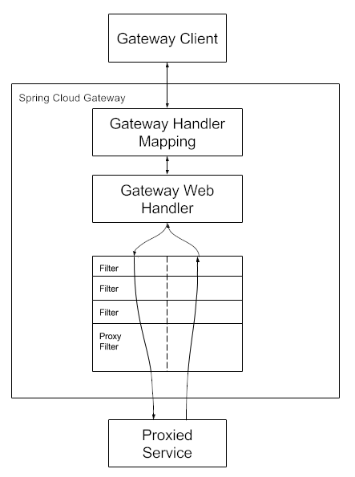

# Spring Cloud Gateway

这个项目提供一个函数库构建 API Gateway 在 Spring WebFlux 或 Spring WebMVC 顶层。

Spring Cloud Gateway 目的是构建一个简单、有效方式去路由 APIs，并向他们提供横切关注点：安全、监控/指标，与弹性。

Spring Cloud Gateway有两种不同的风格：服务器和代理交换。每种风格都提供 WebFlux 和 MVC 兼容性。

- Server 变体是一个功能齐全的API网关，可以独立使用，也可以嵌入到Spring Boot应用程序中。
- ProxyExchange 变体专门用于基于注释的 WebFlux 或 MVC 应用程序，并允许使用特殊的 ProxyExchange 对象作为 web 处理程序方法的参数。

> Spring Cloud Gateway 是按顺序检查路由，找到匹配的路由就会进行请求并返回

## 特性

- 构建在 Spring Framework 和 Spring Boot
- 能够匹配任何请求属性的路由
- 断言（predicates）与过滤（filters）是特定于路由的。
- 熔断机制（Circuit Breaker）集成
- Spring Cloud DiscoveryClient 集成
- 易于编写断言（predicates）与过滤（filters）
- 请求速率限制
- 路径重写

## 快速开始

~~~java
@SpringBootApplication
public class DemogatewayApplication {
	@Bean
	public RouteLocator customRouteLocator(RouteLocatorBuilder builder) {
		return builder.routes()
			.route("path_route", r -> r.path("/get")
				.uri("http://httpbin.org"))
			.route("host_route", r -> r.host("*.myhost.org")
				.uri("http://httpbin.org"))
			.route("rewrite_route", r -> r.host("*.rewrite.org")
				.filters(f -> f.rewritePath("/foo/(?<segment>.*)", "/${segment}"))
				.uri("http://httpbin.org"))
			.route("hystrix_route", r -> r.host("*.hystrix.org")
				.filters(f -> f.hystrix(c -> c.setName("slowcmd")))
				.uri("http://httpbin.org"))
			.route("hystrix_fallback_route", r -> r.host("*.hystrixfallback.org")
				.filters(f -> f.hystrix(c -> c.setName("slowcmd").setFallbackUri("forward:/hystrixfallback")))
				.uri("http://httpbin.org"))
			.route("limit_route", r -> r
				.host("*.limited.org").and().path("/anything/**")
				.filters(f -> f.requestRateLimiter(c -> c.setRateLimiter(redisRateLimiter())))
				.uri("http://httpbin.org"))
			.build();
	}
}
~~~

运行你自己的 gateway 使用 `spring-cloud-starter-gateway` 依赖。

**官方文档地址：**https://docs.spring.io/spring-cloud-gateway/reference/

**官方网站指导**：https://spring.io/guides/gs/gateway

# Spring Cloud Gateway Reactive Server

## 怎样来包含 Spring Cloud Gateway

~~~
groupId: org.springframework.cloud
artifactId: spring-cloud-starter-gateway
~~~

请参阅 [Spring Cloud Project page](https://projects.spring.io/spring-cloud/) 了解使用当前 Spring Cloud Release Train 设置构建系统的详细信息。

如果你添加了 starter，但不想让 gateway 开启，设置：`spring.cloud.gateway.enabled=false`。

Spring Cloud Gateway 需要 Spring Boot 和 Spring Webflux 提供的 Netty 运行时。它不能在传统的Servlet容器中工作，也不能作为WAR 构建。

## 术语

- **Route - 路由**：网关的基本构建块。它由一个ID、一个目标URI、一组断言（predicates）和一组过滤器（Filter）定义。如果聚合谓词为真，则匹配路由。
- **Predicate - 断言**：这时 Java 8 断言。输入类型为 Spring Framework ServerWebExchange。让你匹配任何的 http 请求，例如头和参数。
- **Filter - 过滤器**：这些是使用特定工厂构造的 GatewayFilter 实例。在这里，您可以在发送下游请求之前或之后修改请求和响应。

## 它是如何工作的

下图提供了 Spring Cloud Gateway 工作原理的高级概述：

客户端使请求到 Spring Cloud Gateway。如果网关处理程序映射确定请求与路由匹配，则将其发送到网关 Web 处理程序。此处理程序通过特定于请求的筛选器链运行请求。过滤器用虚线分隔的原因是过滤器可以在发送代理请求之前和之后运行逻辑。执行所有 “pre” 过滤器逻辑。然后发出代理请求。发出代理请求后，将运行 “post” 过滤器逻辑。

> [!NOTE]
>
> 在路由中定义的URI如果没有指定端口，默认会使用80端口和443端口分别作为 HTTP 和 HTTPS URI 的默认端口值。

> [!WARNING]
>
> 在路由 URI 上定义的任何路径都将被忽略。

## 配置路由 Predicate Factories 和 Gateway Filter Factories

### 快捷配置

~~~yaml
spring:
  cloud:
    gateway:
      routes:
      - id: after_route
        uri: https://example.org
        predicates:
        - Cookie=mycookie,mycookievalue
~~~

### 充分扩展的参数

~~~yaml
spring:
  cloud:
    gateway:
      routes:
      - id: after_route
        uri: https://example.org
        predicates:
        - name: Cookie
          args:
            name: mycookie
            regexp: mycookievalue
~~~

## 路由断言工厂

> 如何自定义 AbstractRoutePredicateFactory，先把他提供的过一遍

### The After Route Predicate Factory

~~~yaml
spring:
  application:
    name: gateway
  cloud:
    gateway:
      routes:
        - id: after_route
          uri: http://127.0.0.1:9090
          predicates:
            - After=2024-10-26T00:00:00Z	# AfterRoutePredicateFactory
~~~

### The Before Route Predicate Factory

~~~yaml
spring:
	cloud:
    gateway:
      routes:
        - id: before_route
          uri: http://127.0.0.1:9090
          predicates:
            - Before=2024-08-26T00:00:00Z	#BeforeRoutePredicateFactory
~~~

其余有用到的可以到官方网站中查看，其类型有：

- The Between Route Predicate Factory 
  - `BetweenRoutePredicateFactory`
- The Cookie Route Predicate Factory
  - `CookieRoutePredicateFactory`
  - name
  - regexp
- The Header Route Predicate Factory
  - `HeaderRoutePredicateFactory`
  - name
  - regexp

- The Host Route Predicate Factory
  - `HostRoutePredicateFactory`
- The Method Route Predicate Factory
  - `MethodRoutePredicateFactory`
- The Path Route Predicate Factory 
  - `PathRoutePredicateFactory`
- The Query Route Predicate Factory
  - `QueryRoutePredicateFactory`
- The RemoteAddr Route Predicate Factory
  - `RemoteAddrRoutePredicateFactory`
- The Weight Route Predicate Factory
  - `WeightRoutePredicateFactory`
- The XForwarded Remote Addr Route Predicate Factory
  - `XForwardedRemoteAddrRoutePredicateFactory`

### 自定义一个路由断言工厂

`WolfmanRoutePredicateFactory`

如果是列表：

~~~yaml
spring:
  cloud:
    gateway:
      routes:
        - id: route1
        	uri: http://localhost:8081
          predicates:
            - name: Wolfman
              args:	# 如果定义多个 header
                headerKeys: route1,route2,route3
                headerValues: 1,2,3
~~~

## GatewayFilter Factories

### AddRequestHeader

`AddRequestHeaderGatewayFilterFactory`

> 添加请求 Header

~~~yaml
spring:
  cloud:
    gateway:
      routes:
				- id: add_request_header_route
          predicates:
            - Path=/customer/default-customer-name
          filters:
            - AddRequestHeader=X-Request-Red, Blue
          uri: http://127.0.0.1:9090
~~~

# AddRequestHeadersIfNotPresent

`AbstractGatewayFilterFactory`

~~~yaml
spring:
  cloud:
    gateway:
      routes:
      	- id: add_request_headers_route_2
          uri: http://127.0.0.1:9090
          predicates:
            - Path=/customer/default-customer-name
          filters:
            - AddRequestHeadersIfNotPresent=X-Request-Color-1:blue,X-Request-Color-2:green
~~~

